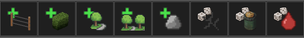

# pq-tools

pq-tools is a set of Tiled tools designed to speed up map-making for the Mapping Tools (Build 42). Originally a personal project, it simplifies tile placement for cracks, random blood, and the new B42 boulders.

by Pabbiqo, from the Unofficial PZ Mapping Discord community.

Version: August 2025 – v4.0

---

## 🔧 Installation (Build 42)

1. Put LuaTools.txt into your Tiled folder.  
2. Delete everything inside Tiled/lua first to avoid conflicts.  
3. Copy the files from the ZIP; B42.Mapping.Tools.zip\TileD\lua into your `Tiled/lua`.  
   You can find them here again: https://github.com/Unjammer/WorldEd/releases  
4. Then copy all the **pq-tools** Lua files from the folder **lua** into `Tiled/lua`.

Since I changed a lot over the last versions, starting fresh this way prevents conflicts. The pq-tools Lua files are almost independent now.

If you copy over pq-tools, only the files **parking-stall** and **tool-four-directions** should pop up  
“Do you want to replace these files?”

---

## Features

- **Parking Stall Tool:** Draws 5 lines instead of 4 for more precise parking spots  
- **More Fences Tool:** Adds all fence types plus powerlines in one go  
- **Greens Tool:** Quickly place hedges, vines, and bushes to add life  
- **Decoration Tool:** Fast placement of garden, street, and trash container decorations  
- **Decoration Tool Multi:** Handles multi-tile objects like slides, sandpiles, and holes  
- **Boulder Tool:** Easy placement of the new B42 boulders  
- **Random Blood, Cracks & Trash Tools:**  
  *(Originally by [BeeArr](https://github.com/TheBeeArr/beearr-tiles-and-tools/tree/main), used with permission)*

---

**Variants and rotations? Covered.**

Many tools come with variants and support different orientations.

Hold **Alt**, **Ctrl**, or **Shift** to rotate objects where supported.  
Some also cycle through models when you click, hold the mouse button, and drag—like short lamp posts.

Random tools don’t rotate (those with a dice icon—the randomness stays random).

---

Built with ❤️ and zero fluff,  

**Pabbiqo**

